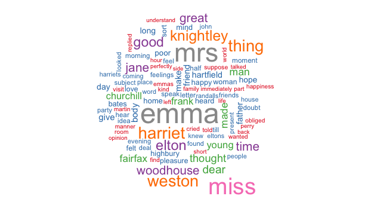

Austen Wordcloud
========================================================
author: Melania S. Masià
date: December 8, 2019
autosize: true

The Austen Wordcloud Shiny app
========================================================
The Austen Wordcloud Shiny app was created as part of the Developing Data Products course.

- The app can be viewed at https://sanmame.shinyapps.io/austen_wordcloud/
- The code can be consulted at https://github.com/sanmame/DevelopingDataProducts


The Austen Wordcloud Shiny app
========================================================
The app generates a word cloud of one of Jane Austen books. The user may select in the side panel
- the book ( "Emma", "Mansfield Park", "Northanger Abbey", "Persuasion", "Pride and Prejudice" or "Sense and Sensibility")
- the minimum frequency of the words in the cloud (from 1 to 50)
- the maximum number of words to appear in the cloud (from 1 to 300).

The books were downloaded from http://www.gutenberg.org


Testing the app
========================================================
For instance, if we select "Emma" with a minimum frequency of 15 and a maximum of 100 words to show (some text formatting is hidden for clarity)...


```r
library(wordcloud)
cloud <- wordcloud(d$word, freq = d$freq, min.freq = 15,
                   max.words=100, colors=brewer.pal(9, "Set1"))
```

Testing the app
========================================================
... we get the following wordcloud, where we see that "mrs" and "emma" are the most frequent words in "Emma".


